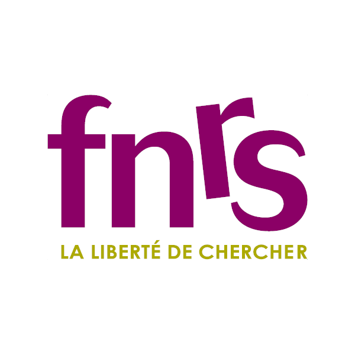
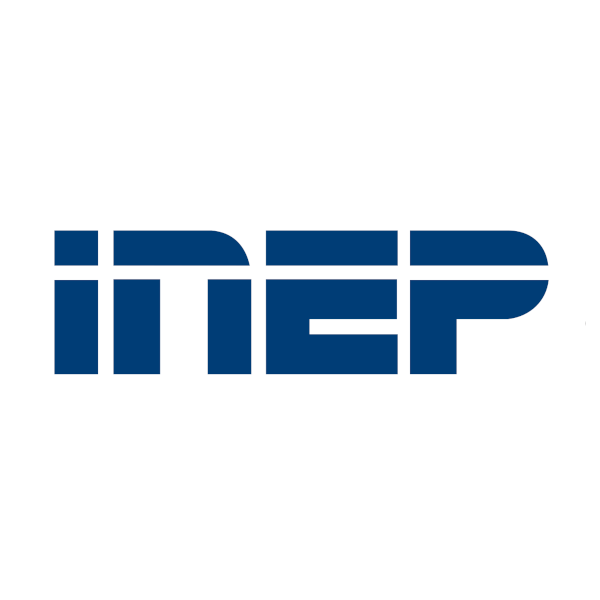
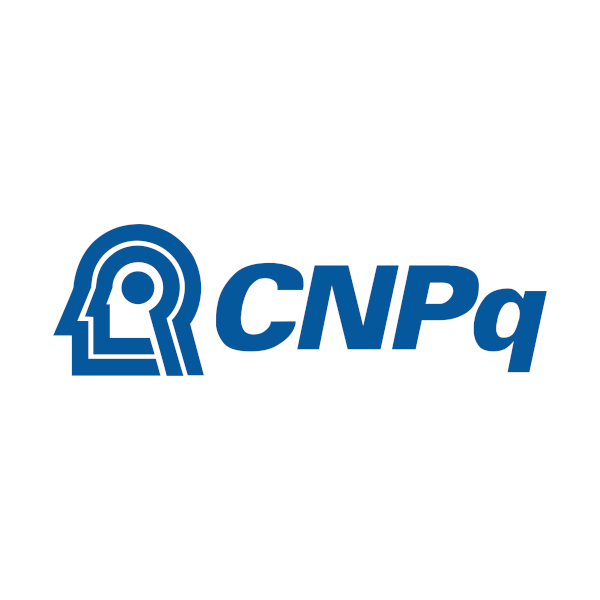
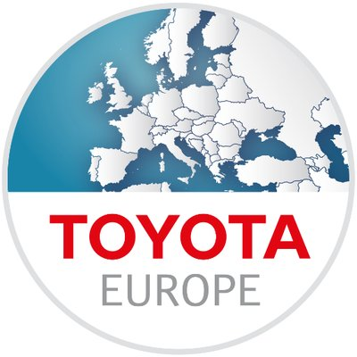
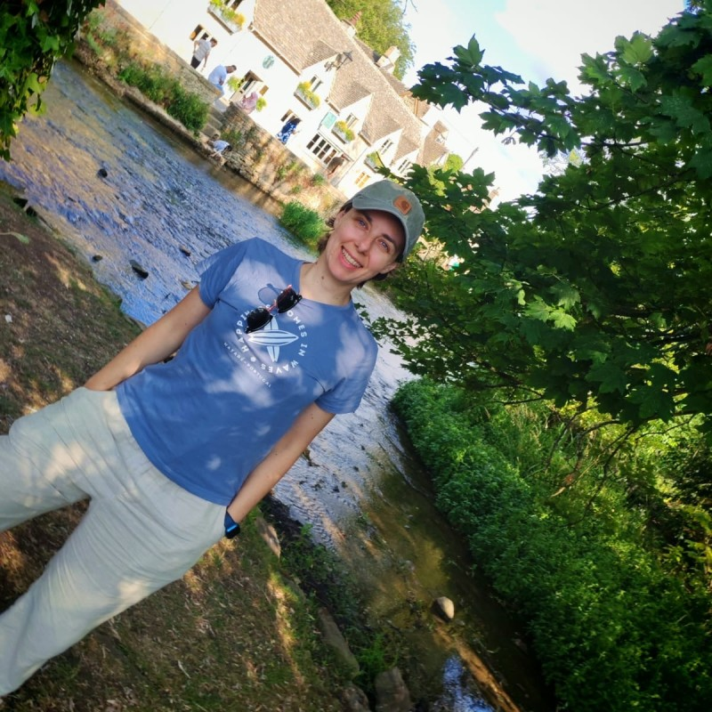

_The National Wallace Monument_ @ **Stirling, Scotland** ([Credits](https://greyarro.ws/t/stirling-castle-the-wallace-monument/60003): John Carroll)  

---

<a name="top"/>

## Bio
_You can check about my **Lectureship in Big Data (Brazil)** and my **PhD in fundamental AI algorithms (Belgium)** [here](sections/bio)._

   

      
   

   

      <strong>I am a Lecturer in Artificial Intelligence (AI) / Data Science at the <a href="https://stir.ac.uk">University of Stirling</a></strong>, which I joined in 2023. My research focuses on <strong>the sociotechnical effects of AI ecosystems</strong>, and is <strong>funded by both the UK and Brazilian governments</strong>.
   

---

   

      
   

   

      <strong>I am part of a research consortium comprising 40 academics from 7 major UK universities</strong>, as well as <strong>25 industry, government, and civil society partners</strong>. Our project entitled <strong>"<em>Participatory Harm Auditing Workbenches and Methodologies</em>"</strong> (<a href="https://phawm.org">PHAWM</a>) was awarded <strong>£3.5 million by <a href="https://rai.uk">Responsible AI UK</a> to enable end-users and decision-subjects of AI applications to participate in their auditing</strong>.
   

---

   

      
   

   

      <strong>I research and supervise computer and social science researchers at the Itaipu Parquetec Technology Park</strong>. The project <strong>"<em>National Observatory of Human Rights</em>"</strong> (<a href="https://observadh.mdh.gov.br/">ObservaDH</a>) is funded with <strong>£2.65 million in collaboration with <a href="https://itaipu.energy">Itaipu Binacional</a> and the <a href="https://mdh.org">Brazilian Ministry of Human Rights and Citizenship</a></strong>. My team investigates <strong>hate speech detection, technology-facilitated gender-based violence, and the political values of LLMs</strong>.
   

---

   

      
   

   

      <strong>I organize the <a href="https://leobezerra.github.io/seminars">Unhyped AI Seminars</a>, a sociotechnical & responsible AI seminar series to improve understanding of AI and its effects on society</strong>. The series is a collaboration with <strong>PHAWM</strong> and the <strong>StirAI multidisciplinary research lab</strong>, with <strong>guest speakers from academia, industry, government, and civil society</strong>.
   

   
  
  
  
  
  

--- 

<a name="places" class="section">
  
## Places, People & Organisations
_You can find more information on how to explore the interactive map below [here](sections/places)._

<!--
In addition to my formal collaborations through supervision and authoring, I have also met incredible people along my research career.
- **Wider network**, researchers that always wholeheartedly assist me when I reach out to them.
- **IRIDIAns**, the whole family of researchers that graduated with my from the IRIDIA lab.
- **Alumni**, the amazing students I had the privilege to supervise.
  
Check their whereabouts (updated eventually) at the interactive map below.
-->

<iframe src="places.html" height="500" width="100%" frameBorder=0></iframe>
 

  

_The affiliation information in the map above is updated sporadically._

[Back to the top](#top)

--- 

<a name="news" class="section">

## News

_You can check past news [here](sections/news)._

### Autumn 2025

   

      
   

   

      I invited <strong>Dr. Raffaele Ciriello</strong> from the <strong>University of Sydney</strong> for a talk at the <strong><em>AI Companions & Relationships</em></strong> edition of the <a href="https://leobezerra.github.io/seminars">Unhyped AI Seminars</a>.   
      The talk will be hosted by the <strong>StirAI Lab</strong> and the <strong>PHAWM research project</strong> on May 4th.
   

   

      
   

   

      I invited <strong>Dr. Alberto Franzin</strong> from the <strong>EU AI Office</strong> for a meet-up at the <strong><em>AI & Government</em></strong> edition of the <a href="https://leobezerra.github.io/seminars">Unhyped AI Seminars</a>.   
      The talk will be hosted by the <strong>StirAI Lab</strong> and the <strong>PHAWM research project</strong> on March 30th.
   

   

      
   

   

      I invited <strong>Dr. Anna Rezk-Parker</strong> from the <strong>University of Glasgow</strong> for a talk at the <strong><em>AI & Media</em></strong> edition of the <a href="https://leobezerra.github.io/seminars">Unhyped AI Seminars</a>.   
      The talk will be hosted by the <strong>StirAI Lab</strong> and the <strong>PHAWM research project</strong> on March 3rd.
   

   

      
   

   

      Alongside the <strong>School of Law & Philosophy</strong> I invited <strong>Prof. Ron Chrisley</strong> from the <strong>University of Sussex</strong> for a talk at the <strong><em>AI & Language</em></strong> edition of the <a href="https://leobezerra.github.io/seminars">Unhyped AI Seminars</a>.   
      The talk will be hosted by the <strong>StirAI Lab</strong> and the <strong>PHAWM research project</strong> on February 19th.
   

   

      
   

   

      I invited <strong>Dr. Michaela Hruskova, Dr. Vassilis Galanos, Dr. Simon Powers, Dr. Conor McKeown</strong> from the <strong>University of Stirling</strong> for a meet-up at the <strong><em>AI & Coding</em></strong> edition of the <a href="https://leobezerra.github.io/seminars">Unhyped AI Seminars</a>.   
      The talk will be hosted by the <strong>StirAI Lab</strong> and the <strong>PHAWM research project</strong> on January 20th.
   

   

      
   

   

      I was nominated for <strong>Outstanding Activity to Support Research</strong> by the <strong>Research Culture Awards</strong> of the <a href="https://stir.ac.uk">University of Stirling</a>.   
      The nomination was a result of my work organising the <a href="https://leobezerra.github.io/seminars">Unhyped AI Seminars</a>.
   

[Back to the top](#top)

---

<a name="history" class="section">

## History

_You can check about nominations I received and the languages I speak [here](sections/history)._

### Appointments (3)

   

      
   

   

      <strong>Lecturer</strong> @ <a href="https://stir.ac.uk">University of Stirling</a>   
        
   

   

      
   

   

      <strong>Assistant professor</strong> @ <a href="https://ufrn.br">Federal University of Rio Grande do Norte (UFRN)</a>   
        
   

   

      
   

   

      <strong>Assistant professor</strong> @ <a href="https://ufpb.br">Federal University of Paraíba (UFPB)</a>   
        
   

---

### Awards (5)

   

      
   

   

      <strong>Keystone Project</strong> @ <a href="https://rai.ac.uk">Responsible AI UK</a>   
       
   

<!--
**Keystone Project** @ [Responsible AI UK](https://rai.ac.uk)

 
-->

   

      
   

   

      <strong>Alain Bensoussan fellowship</strong> @ <a href="https://www.ercim.eu">European Research Consortium for Informatics and Mathematics</a>   
       
   

<!--
**Alain Bensoussan fellowship** @ [European Research Consortium for Informatics and Mathematics (ERCIM)](https://www.ercim.eu)

 
-->

   

      
   

   

      <strong>Ph.D. degree in Engineering and Technology</strong> @ <a href="https://ulb.ac.be">Université Libre de Bruxelles</a>   
        
 
 
   

   

      
   

   

      <strong>F.R.I.A doctoral fellowship</strong> @ <a href="https://frs-fnrs.be">Fonds de la Recherche Scientifique</a>   
        
   

   

      
   

   

      <strong>Best paper award</strong> @ <a href="https://grv.inf.pucrs.br/svr2009">Brazilian Symposium on Augmented and Virtual Reality (SVR)</a>   
       
   

[Back to the top](#top)

---

<a name="projects" class="section">

## Projects and funding

_Financial details about the projects are provided in my [CV](#top)._

### Proponent (5)

   

      
   

   

      <strong>Participatory harm auditing workbenches and methodologies (<a href="https://phawm.org">PHAWM</a>)</strong> @ <a href="https://rai.ac.uk">Responsible AI UK</a>   
          
   

   

      
   

   

      <strong>Technological innovation cell</strong> @ <a href="https://www.neoenergia.com">Iberdrola Neoenergia COSERN</a>   
         
   

   

      
   

   

      <strong>Applied research and human resource development in hardware technologies for artificial intelligence</strong>  
      @ <a href="https://huawei.com.br">Huawei Telecommunications in Brazil</a>   
        
 
 
   

   

      
   

   

      <strong>Revision and update of the Brazilian Standard Classification of Education (<a href="https://www.gov.br/inep/pt-br/areas-de-atuacao/pesquisas-estatisticas-e-indicadores/cine-brasil">CINE Brasil</a>)</strong>  
      @ <a href="https://unesco.org">UNESCO</a> & <em>Brazilian Ministry of Education</em> – <a href="https://www.gov.br/inep/pt-br">INEP</a>   
        
 
 
   

   

      
   

   

      <strong>Generalization of metaheuristics for optimization problems with three or more objectives</strong>  
      @ <a href="https://frs-fnrs.be">Fonds de la Recherche Scientifique (FNRS)</a>   
          
   

---

### Collaborator (6)

   

      
   

   

      <strong>Human rights observatory (<a href="https://observadh.mdh.gov.br/">ObservaDH</a>)</strong> @ <a href="https://www.itaipuparquetec.org.br">Itaipu Parquetec Technology Park</a>   
          
   

   

      
   

   

      <strong>Information technology graduate apprenticeship</strong>  
      <em>MSc class of 2023</em> @ <a href="https://trf5.jus.br">5th Region Federal Regional Court (TRF5)</a>  
      <em>MSc class of 2024</em> @ <a href="https://trf5.jus.br">5th Region Federal Regional Court (TRF5)</a>   
           
   

   

      
   

   

      <strong>SmartMetropolis</strong> @ <em>Multiple local and national government branches</em>   
             
   

   

      
   

   

      <strong>Combinatorial optimization: metaheuristics and exact methods (<a href="https://mathopt.be/comex.ulb.ac.be/">COMEX</a>)</strong>  
      @ <a href="https://belspo.be">Belgian Federal Science Policy Office (BELSPO)</a>   
         
   

   

      
   

   

      <strong>Algorithms for mobile robot path planning considering multiple objectives</strong>  
      @ <a href="https://www.gov.br/cnpq/pt-br">National Council for Scientific and Technological Development (CNPq)</a>   
         
   

[Back to the top](#top)

---

<a name="theses" class="section">

## Supervision

_You can check about my **Graduate Apprenticeship (MSc)** and **Undergraduate** dissertation and publication supervisions [here](sections/supervision)._

### Researchers

   

      
   

   

      <strong>Information democratiser or desinformation multiplier? How artificial intelligence became a tool for reproducing race, class, and gender violence in digital spaces</strong> @ <a href="https://www.itaipuparquetec.org.br">Itaipu Parquetec Technology Park</a>   
       
 

 
   

   

      
   

   

      <strong>Participatory harm auditing workbenches and methodologies (<a href="https://phawm.org">PHAWM</a>)</strong> @ <a href="https://stir.ac.uk">University of Stirling</a>   
       
 
 
   

---

### Doctorate

   

      
   

   

      <strong>Auditing large language models (LLMs): from political bias to human rights</strong>  
      <em>Systems and computing</em> @ <a href="https://ufrn.br">Federal University of Rio Grande do Norte (UFRN)</a>   
        
 

 
   

   

      
   

   

      <strong>Design configuration for the MMAS algorithm applied to the travelling salesman problem with dynamic demands</strong> @ <a href="https://cefetmg.br">Federal Center of Technological Education of Minas Gerais (CEFET-MG)</a>   
       
 

  
   

---

### Masters

- A Masters degree in Brazil comprises 1 year of disciplines and 1 or 2 years of research.
- Each concluded dissertation below led to the publication of one or more papers in international conferences.

   

      
   

   

      <strong>Political bias in large language models (LLMs): a critical review and a responsible methodology</strong>  
      <em>Systems and computing</em> @ <a href="https://ufrn.br">Federal University of Rio Grande do Norte (UFRN)</a>   
       
 

   

   

      
   

   

      <strong>Ensuring priority rights for people assisted by the Public Defendant's Office of Rio Grande do Norte through responsible data science</strong>  
      <em>Systems and computing</em> @ <a href="https://ufrn.br">Federal University of Rio Grande do Norte (UFRN)</a>   
       
 

   

   

      
   

   

      <strong>A case study on customer segmentation of a supermarket chain</strong>  
      <em>Information technology</em> @ <a href="https://ufrn.br">Federal University of Rio Grande do Norte (UFRN)</a>   
       
 

   

   

      
   

   

      <strong>Sales forecasting for a supermarket chain in Natal, Brazil: an empirical assessment</strong>  
      <em>Information technology</em> @ <a href="https://ufrn.br">Federal University of Rio Grande do Norte (UFRN)</a>   
        
 

 

   

   

      
   

   

      <strong>Assessing irace for automated machine and deep learning in computer vision</strong>  
      <em>Information technology</em> @ <a href="https://ufrn.br">Federal University of Rio Grande do Norte (UFRN)</a>   
        
 

 

   

   

      
   

   

      <strong>Predspot: predicting crime hotspots with machine learning</strong>  
      <em>Systems and computing</em> @ <a href="https://ufrn.br">Federal University of Rio Grande do Norte (UFRN)</a>   
       
 

 

   

   

      
   

   

      <strong>A metaheuristic approach to the high school timetabling problem at IFRN</strong>  
      <em>Information technology</em> @ <a href="https://ufrn.br">Federal University of Rio Grande do Norte (UFRN)</a>   
        
 

 
   

[Back to the top](#top)

---

<a name="publications" class="section">

## Key and relevant publications

_An exhaustive publication list with full author description is provided in my [CV](#top)._

### Journals (6)

**Can there be responsible AI without AI liability? Incentivizing generative AI safety through ex-post tort liability under the EU AI liability directive**

  
 
 
 

This paper is the first contribution of my Lectureship in AI / Data Science in the UK, and discusses whether and how existing and novel regulation need to be revised to address generative AI (GenAI). The relevance of this paper is evidenced by its timing, as the paper was published at the peak of both the (i) surge in GenAI adoption and  (ii) regulatory push from the European Union regarding AI. Importantly, this paper addresses policy and regulation, evidencing the multidisciplinary nature of my current Lectureship and research thereof.

---

**A computational study on ant colony optimization for the traveling salesman problem with dynamic demands**

  
 
 
 

This paper was the main contribution from the first Ph.D. thesis I
co-supervised, and demonstrates how multi-objective and dynamic
optimization intersect. The relevance of this paper is evidenced by its
best paper award nomination at the EMO 2019 conference, where a
preliminary version of the journal paper was first published. In
addition, this paper is a concrete example of how I bridge different
research topics into multi-disciplinary work.

---

**Comparing community mobility reduction between first and second COVID-19 waves**

  
 
 
 

This paper was the main contribution of my efforts in science
publication and communication to assist in the fight against the
COVID-19 pandemic. Indeed, the first author of this paper is one of the
undergraduate students that I helped mobilize in those initiatives. The
relevance of this paper is evidenced by the number of different
continents and COVID-19 waves included in the assessment. In addition,
this paper is a concrete example of how I use computational intelligence
in the context of socially relevant problems.

---

**Automatically designing state-of-the-art multi-and many-objective evolutionary algorithms**

  

 
 

**A large-scale experimental evaluation of high-performing multi-and many-objective evolutionary
algorithms**

  

 
 

**Automatic component-wise design of multiobjective evolutionary algorithms**

  
 
 
 

These papers comprise the contributions of my Ph.D. thesis, having been
accepted for publication prior to my defense or shortly after. Their
relevance is evidenced by their ongoing impact on the evolutionary
computation community, one of the most important in the context of CI,
and by the rigorous journals where they were published. More
importantly, these papers demonstrate how I am able to plan and deliver
on a research project. In detail, each paper meets an specific objective
of my thesis proposal, incrementally achieving the general objective of
the project.

---

### Conference papers (12)

**Optimizing the logistics operations of distribution network operators from a multinational electric utility company**

 
 
 
 
 

**Retail sales forecasting for a Brazilian supermarket chain: an empirical assessment**

 
 
 
 
 

**Supermarket customer segmentation: a case study in a large Brazilian retail chain**

 
 

 
 

These papers comprise the contributions of the data science projects and MSc+MPhil theses I
(co-)supervised in partnership with private institutions. In detail, the first paper results from a collaboration with
Neoenergia, the Brazilian subsidiary of the Spanish multinational utility company Iberdrola.
In turn, the 2022 papers use AI techniques to model
different business processes in the 3rd largest retail supermarket chain
in the Northeast of Brazil, and are instrumental to assess the impact of
the COVID-19 pandemic in the industry. 

---

**High school timetabling at a federal educational institute in Brazil**

 
 
 
 
 

**Time-series features for predictive policing**

 
 

 

**Towards a crime hotspot detection framework for patrol planning**

 
 

 
 

These papers comprise the contributions of the data science projects and MSc+MPhil theses I
(co-)supervised in partnership with public institutions. The
relevance of these papers is evidenced by the socially relevant
scenarios they address. In detail, the first paper focuses on the
Brazilian Federal Network of Vocational, Scientific and Technological
Education, which provides education to over two million students, with
over half of the students that declared income, gender, and ethnicity
coming from low income families, being women, and self-declaring as
non-white. In turn, the 2018 papers address
predictive policing to assist the local government in the forecasting of
criminal occurrences.

---

**Evaluating anytime performance on NAS-Bench-101**

 
 

 
 

**iSklearn: automated machine learning with irace**

 
 

 
 

**Comparing contextual embeddings for semantic textual similarity in Portuguese**

  

 

These papers are the contributions of MSc+MPhil theses I supervised in deep
and automated machine learning. The relevance of these papers is
evidenced by the state-of-the-art techniques that were employed. In
addition, the application domains considered are among the most relevant
that use unstructured data, namely computer vision, natural language
processing, and time series forecasting. Importantly, these papers
demonstrate that I understand the technological complexity of current
state-of-the-art AI models, their potential impact on society, and
therefore their need for accountability.

---

**Revisiting Pareto-optimal multi-and many-objective reference fronts for continuous optimization**

 
 

 
 

**Archiver effects on the performance of state-of-the-art multi-and many-objective evolutionary algorithms**

 
 

 
 

**An empirical assessment of the properties of inverted generational distance on multi-and many-objective optimization**

 
 

 
 

These papers comprise follow-up works on my Ph.D. thesis. The relevance
of these papers is evidenced by their ongoing impact on the evolutionary
computation community, as well as the conferences where they were
published, which are among the top-tier venues in their field. More
importantly, these papers are a concrete example that the work I
conducted in my Ph.D. was seminal to relevant future work. In addition,
they demonstrate that I understand that seeking autonomy as an
independent researcher does not mean discontinuing previous research.

[Back to the top](#top)
  
---

<a name="communication" class="section"/>

## Science communication, networking, and community

_You can check about my COVID-19 engagement and my communication and networking activities in Brazil [here](sections/communication)._

### Unhyped AI Seminars

   

      
   

   

      <strong>Brave new world of AI companion apps</strong> @ <a href="https://leobezerra.github.io/seminars/#relationships">AI Companions & Relationships Edition</a>   
        
       

   

   

      
   

   

      <strong>Innovation & regulation: the European Union approach to trustworthy AI</strong> @ <a href="https://leobezerra.github.io/seminars/#government">AI & Government Edition</a>   
        
       

   

   

      
   

   

      <strong>Beyond the click: AI search and the disintermediation of news</strong> @ <a href="https://leobezerra.github.io/seminars/#media">AI & Media Edition</a>   
        
       

   

   

      
   

   

      <strong>Apropos of nothing? Singular reference and semantic grounding in LLMs</strong> @ <a href="https://leobezerra.github.io/seminars/#language">AI & Language Edition</a>   
        
       

   

   

      
   

   

      <strong>Vibe coding in higher education</strong> @ <a href="https://leobezerra.github.io/seminars/#coding">AI & Coding Edition</a>   
          
       

   

   

      
   

   

      <strong>Gender, violence and artificial intelligence</strong> @ <a href="https://leobezerra.github.io/seminars/#gender">AI & Gender Edition</a>   
        

   

   

      
   

   

      <strong>The challenges of digital ethics & responsible AI</strong> @ <a href="https://leobezerra.github.io/seminars/#governance">AI & Governance Edition</a>   
        
 

   

   

      
   

   

      <strong>Mathematical models for dominance move</strong> @ <a href="https://leobezerra.github.io/seminars/#metrics">AI & Metrics Edition</a>   
       
 

   

---
   
### Communication and networking

**Empowering decision-subjects & end-users to audit AI applications**

   

      
   

   

      <strong>@</strong> <em>AI Safety Unit 4</em> - <a href="https://digital-strategy.ec.europa.eu/en/policies/ai-office">European Union AI Office</a>   
        
       
      
   

---

**AI Data Ready: Challenges and opportunities for companies preparing for AI**

   

      
   

   

      <strong>@</strong> <em>Confraria de dados</em> - <a href="https://google.com">Google Brasil</a>   
        
       
      
   

---

**Supporting society to assess AI**

   

      
   

   

      <strong>@</strong> <em>AI & Governance Edition</em> - <a href="https://leobezerra.github.io/seminars">Unhyped AI Seminars</a>   
        
       
      
   

   

      
   

   

      <strong>@</strong> <em>Data & AI Meet-up: Ethics</em> - <a href="https://thedatalab.com">The Data Lab</a>   
        
       
      
   

---

**FAIRTECH by design: assessing and addressing the social impacts of artificial intelligence** 

   

      
   

   

      <strong>@</strong> <em>Decision and Cognitive Science Research Centre</em> - <a href="https://www.manchester.ac.uk">University of Manchester</a>   
        
       
      
   

   

      
   

   

      <strong>@</strong> <em>School of Computer Science</em> - <a href="https://www.st-andrews.ac.uk">University of St Andrews</a>   
        
       
      
   

   

      
   

   

      <strong>@</strong> <em>Aerospace Centre of Excellence</em> - <a href="https://www.strath.ac.uk">University of Strathclyde</a>   
        
       
      
   

   

      
   

   

      <strong>@</strong> <em>Chair for Artificial Intelligence Methodologies</em> - <a href="https://rwth-aachen.de">RWTH Aachen University</a>   
        
       
      
   

   

      
   

   

      <strong>@</strong><em>Advanced Technology R&D Division</em> - <a href="https://toyota-europe.com">Toyota Motor Europe</a>   
        
       
      
   

   

      
   

   

      <strong>@</strong> <em>IRIDIA Artificial Intelligence Lab</em> - <a href="https://ulb.ac.be">Université Libre de Bruxelles (ULB)</a>   
        
       
      
   

---

**Promoting and sustaining accountability in artificial intelligence applications** 

   

      
   

   

      <strong>@</strong> <em>Computing Science and Mathematics (CSM) Public Lectures</em> - <a href="https://stir.ac.uk">University of Stirling</a>   
        
       
      
   

   

      
   

   

      <strong>@</strong> <em>Data Science Institute (DSI)</em> - <a href="https://lse.ac.uk">London School of Economics and Political Sciences</a>   
        
       
      
   

   

      
   

   

      <strong>@</strong> <em>Information, Data, and Analysis (IDA) Section</em> - <a href="https://gla.ac.uk">University of Glasgow</a>   
        
       
      
   

   

      
   

   

      <strong>@</strong> <em>Software Systems Engineering (SSE) Group</em> - <a href="https://ucl.ac.uk">University College London (UCL)</a>   
        
       
      
   

   

      
   

   

      <strong>@</strong> <em>Computing Science and Mathematics (CSM) Seminars</em> - <a href="https://stir.ac.uk">University of Stirling</a>   
        
       
      
   

   

      
   

   

      <strong>@</strong> <em>Aston Centre for Artificial Intelligence Research and Applications (ACAIRA)</em> - <a href="[https://stir.ac.uk](https://www.aston.ac.uk/)">Aston University</a>   
       
       
      
   

  
[Back to the top](#top)  
