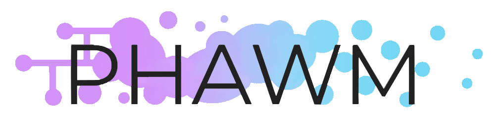

<a name="top"/>

## Bio

<!-- <h1>Leonardo C. T. Bezerra</h1>  -->

**I am a Lecturer in Artificial Intelligence (AI) / Data Science at the University of Stirling**, which I joined in 2023. My research focuses on **the sociotechnical effects of AI ecosystems**, and is **funded by both the UK and Brazilian governments**. 

   

      
   

   

      <strong>I am part of a research consortium comprising 40 academics from 7 major UK universities</strong>, as well as <strong>25 industry, government, and civil society partners</strong>. Our project entitled <strong>"<em>Participatory Harm Auditing Workbenches and Methodologies</em>"</strong> (<a href="https://phawm.org">PHAWM</a>) was awarded <strong>£3.5 million by <a href="https://rai.uk">Responsible AI UK</a> to enable end-users and decision-subjects of AI applications to participate in their auditing</strong>. The project started in May 2024, has <strong>a total budget of £4 million</strong> and will last for 42 months.
   

<!--
- **I am part of a research consortium comprising 40 academics from 7 major UK universities**, as well as **25 industry, government, and civil society partners**. Our project entitled **"_Participatory Harm Auditing Workbenches and Methodologies_"** ([PHAWM](https://phawm.org)) was awarded **£3.5 million by [Responsible AI UK](https://rai.uk) to enable end-users and decision-subjects of AI applications to participate in their auditing**. The project started in May 2024, has **a total budget of £4 million** and will last for 42 months.
-->

- **I research and supervise computer and social science graduate students at the Itaipu Parquetec Technology Park**. The project entitled **"_National Observatory of Human Rights_"** ([ObservaDH](https://observadh.mdh.gov.br/)) started in Nov 2023, will last 48 months and is funded with **£2.65 million** from **[Itaipu Parquetec](https://www.itaipuparquetec.org.br)**,  **[Itaipu Binacional](https://itaipu.energy)** and the **[Brazilian Ministry of Human Rights and Citizenship](https://mdh.org)**. My team investigates **hate speech detection**, **technology-facilitated gender-based violence**, and **the political alignment/biases of Large Language Models**. 

- **I organize the [Unhyped AI Seminars](https://leobezerra.github.io/seminars), a sociotechnical & responsible AI seminar series to improve understanding of AI and its effects on society**. The series started on Autumn 2024 and is hosted in collaboration with **PHAWM** and the **StirAI multidisciplinary research lab**, with **guest speakers from academia, industry, government, and civil society**.

_You can check about my **Lectureship in Big Data (Brazil)** and my **PhD in fundamental AI algorithms (Belgium)** clicking [here](bio)._

   
  
  
  
  
  

<!--
- **I am applying for funding to promote a society where AI systems are fair, accountable, inclusive, responsible, transparent, ethical, carbon-neutral, and human-centred (FAIRTECH) by design**. To achieve this, I will:

  1. structure an **Observatory of the Potentially Incurred Social Damage from Artificial Intelligence (PISD.ai)**, which will survey current (and future) relevant real-world examples where the **lack of appropriate AI regulation (potentially) incurs significant social damage**. A prototypical  example is **the role of social media recommendation algorithms in disinformation** and its impact on **democracy, human rights, public health, and climate change**, and how this impact can be further **worsened by generative AI**.
  2. survey the existing **AI regulation proposals** from major Western and non-Western democratic players, as well as the **legal, economical, and technical limitations** for appropriate regulation. Major player examples include the **European Union**, the **United Kingdom**, the **United States of America**, **Brazil**, **Chile**, and **Japan**.
  3. propose **validation frameworks to assist AI regulators and policymakers** in their proposals and/or revisions. Examples include the **appropriate definition of artificial intelligence systems** to reduce the **risk of overregulation**. 
  4. formulate an **educational framework** to promote a **FAIRTECH by design culture**, targeting key players in government, academia, industry, and civil society more broadly. Relevant partners that have already demonstrated interest include the **Brazilian Computing Society**, **Brazilian Ministry of Human Rights and Citizenship**, and **Toyota Motor Europe**.
-->

<!--
---

## Contents

1. [News](#news)
2. [Places & People](#places)
3. [History](#history)
4. [Projects and funding](#projects)
5. [Supervision](#theses)
6. [Key and relevant publications](#publications)
7. [Science communication, networking, and community](#communication)
-->

--- 

<a name="news" class="section">

## News

### Autumn 2025

- I invited **Dr. Raffaele Ciriello** from the **University of Sydney** for a talk at the **"_AI Companions & Relationships_"** edition of the [Unhyped AI Seminars](https://leobezerra.github.io/seminars). The talk will be hosted by the **StirAI Lab** and the **PHAWM research project** on May 4th.

- I invited **Dr. Alberto Franzin** from the **EU AI Office** for a meet-up at the **"_AI & Government_"** edition of the [Unhyped AI Seminars](https://leobezerra.github.io/seminars). The talk will be hosted by the **StirAI Lab** and the **PHAWM research project** on March 30th. 

- I invited **Dr. Anna Rezk-Parker** from the **University of Glasgow** for a talk at the **"_AI & Media_"** edition of the [Unhyped AI Seminars](https://leobezerra.github.io/seminars). The talk will be hosted by the **StirAI Lab** and the **PHAWM research project** on March 3rd. 

- Alongside the **School of Law & Philosophy**, I invited **Prof. Ron Chrisley** from the **University of Sussex** for a talk at the **"_AI & Language_"** edition of the [Unhyped AI Seminars](https://leobezerra.github.io/seminars). The talk will be hosted by the **StirAI Lab** and the **PHAWM research project** on February 19th. 

- I invited **Dr. Michaela Hruskova**, **Dr. Vassilis Galanos**, **Dr. Simon Powers** and **Dr. Conor McKeown** from the **University of Stirling** for a meet-up at the **"_AI & Coding_"** edition of the [Unhyped AI Seminars](https://leobezerra.github.io/seminars). The talk will be hosted by the **StirAI Lab** and the **PHAWM research project** on January 20th.
 
- I was nominated for **Outstanding Activity to Support Research** by the **Research Culture Awards** of the [University of Stirling](https://www.stir.ac.uk/), as a result of my work organising the [Unhyped AI Seminars](https://leobezerra.github.io/seminars).

<!--

### Summer 2025

- I invited **Carolline Querino** from **Cajú Consultoria Nordestina / Itaipu ParqueTec** for a talk at the [Unhyped AI Seminars](https://leobezerra.github.io/seminars). The talk was hosted by the **StirAI Lab** and the **PHAWM research project** on August 29th, entitled **"_Gender, Violence and Artificial Intelligence: How Generative AI Reproduces Violence Online_"**. 

- I was invited by **Responsible AI UK** for an **"_All Hands Meeting_"** gathering funded research projects, our partners, and relevant stakeholders, which will take place from November 18th to 19th, 2025, at the [Mercure Manchester Picaddily Hotel](https://maps.app.goo.gl/RSUc9agRqunyT8jr6).

-->
  
_You can check past news [here](news)._

[Back to the top](#top)

--- 

<a name="places" class="section">
  
## Places & People 

<iframe src="places.html" height="500" width="100%" frameBorder=0></iframe>

_The affiliation information in the map above is updated sporadically._

[Back to the top](#top)

---

<a name="history" class="section">

## History

### Appointments (3)

**Lecturer** @ [University of Stirling](https://stir.ac.uk)

  

**Assistant professor** @ [Federal University of Rio Grande do Norte (UFRN)](https://ufrn.br)

  

**Assistant professor** @ [Federal University of Paraíba (UFPB)](https://ufpb.br)

  

### Awards (5)

**Keystone Project** @ [Responsible AI UK](https://rai.ac.uk)

 

**Alain Bensoussan fellowship** @ [European Research Consortium for Informatics and Mathematics (ERCIM)](https://www.ercim.eu)

 

**Ph.D. degree in Engineering and Technology** @ [Université Libre de Bruxelles (ULB)](https://ulb.ac.be/)

  
 
 

**F.R.I.A doctoral fellowship** @ [Fonds de la Recherche Scientifique (FNRS)](https://frs-fnrs.be)

  

**Best paper award** @ [Brazilian Symposium on Augmented and Virtual Reality (SVR)](https://grv.inf.pucrs.br/svr2009)

 

### Nominations (3)

**Outstanding Activity to Support Research** @ _Research Culture Awards_, [University of Stirling](https://stir.ac.uk)

 

**Outstanding Early Career Researcher** @ _Research Culture Awards_, [University of Stirling](https://stir.ac.uk)

 

**Best paper award** @ [Evolutionary Multi-Criterion Optimization (EMO)](https://link.springer.com/book/10.1007/978-3-030-12598-1)

 

### Languages (5)

     

[Back to the top](#top)

---

<a name="projects" class="section">

## Projects and funding

_Financial details about the projects are provided in my [CV](#top)._

### Proponent (5)

**Participatory harm auditing workbenches and methodologies (PHAWM)** @ [Responsible AI UK](https://rai.ac.uk)

     

**Technological innovation cell** @ [Iberdrola Neoenergia COSERN](https://www.neoenergia.com)

    

**Applied research and human resource education in hardware technologies for artificial intelligence** @ [Huawei Telecommunications in Brazil](https://huawei.com.br/)

  
 
 

**Revision and update of the Brazilian Standard Classification of Education (CINE Brasil)** @ [UNESCO](https://unesco.org/) & Brazilian Ministry of Education – [INEP](https://www.gov.br/inep/pt-br)

  
 
 

**Generalization of metaheuristics for optimization problems with three or more objectives** @ [Fonds de la Recherche Scientifique (FNRS)](https://frs-fnrs.be)

    

### Collaborator (6)

**Human rights observatory (ObservaDH)** @ [Itaipu Parquetec Technology Park](https://www.itaipuparquetec.org.br)

    

<!-- -->

**Information technology graduate apprenticeship (MSc class of 2024)** @ [5th Region Federal Regional Court (TRF5)](https://trf5.jus.br)

     

**Information technology graduate apprenticeship (MSc class of 2023)** @ [5th Region Federal Regional Court (TRF5)](https://trf5.jus.br)

     

**SmartMetropolis** @ Multiple local and national government branches

      

**Combinatorial optimization: metaheuristics and exact methods (COMEX)** @ [Belgian Federal Science Policy Office (BELSPO)](https://belspo.be/)

    

**Algorithms for mobile robot path planning considering multiple objectives** @ [National Council for Scientific and Technological Development (CNPq)](https://www.gov.br/cnpq/pt-br)

   

[Back to the top](#top)

---

<a name="theses" class="section">

## Supervision

### PhD

**Auditing large language models (LLMs): from political bias to human rights** @ [Federal University of Rio Grande do Norte (UFRN)](https://ufrn.br)

  
 

 

**Design configuration for the MMAS algorithm applied to the travelling salesman problem with dynamic demands** @ [Federal Center of Technological Education of Minas Gerais (CEFET-MG)](https://cefetmg.br)

 
 

 

### MSc+MRes

**Political bias in large language models (LLMs): a critical review and a responsible methodology** @ [Federal University of Rio Grande do Norte (UFRN)](https://ufrn.br)

 
 

**Ensuring priority rights for people assisted by the Public Defendant's Office of Rio Grande do Norte through responsible data science** @ [Federal University of Rio Grande do Norte (UFRN)](https://ufrn.br)

 
 

**A case study on customer segmentation of a supermarket chain** @ [Federal University of Rio Grande do Norte (UFRN)](https://ufrn.br)

 
 

**Sales forecasting for a supermarket chain in Natal, Brazil: an empirical assessment** @ [Federal University of Rio Grande do Norte (UFRN)](https://ufrn.br)

  
 

 

**Assessing irace for automated machine and deep learning in computer vision** @ [Federal University of Rio Grande do Norte (UFRN)](https://ufrn.br)

  
 

 

**Predspot: predicting crime hotspots with machine learning** @ [Federal University of Rio Grande do Norte (UFRN)](https://ufrn.br)

 
 

 

**A metaheuristic approach to the high school timetabling problem at IFRN** @ [Federal University of Rio Grande do Norte (UFRN)](https://ufrn.br)

  
 

 

[Back to the top](#top)

---

<a name="publications" class="section">

## Key and relevant publications

_An exhaustive publication list with full author description is provided in my [CV](#top)._

### Journals (6)

**Can there be responsible AI without AI liability? Incentivizing generative AI safety through ex-post tort liability under the EU AI liability directive**

  
 
 
 

This paper is the first contribution of my Lectureship in AI / Data Science in the UK, and discusses whether and how existing and novel regulation need to be revised to address generative AI (GenAI). The relevance of this paper is evidenced by its timing, as the paper was published at the peak of both the (i) surge in GenAI adoption and  (ii) regulatory push from the European Union regarding AI. Importantly, this paper addresses policy and regulation, evidencing the multidisciplinary nature of my current Lectureship and research thereof.

---

**A computational study on ant colony optimization for the traveling salesman problem with dynamic demands**

  
 
 
 

This paper was the main contribution from the first Ph.D. thesis I
co-supervised, and demonstrates how multi-objective and dynamic
optimization intersect. The relevance of this paper is evidenced by its
best paper award nomination at the EMO 2019 conference, where a
preliminary version of the journal paper was first published. In
addition, this paper is a concrete example of how I bridge different
research topics into multi-disciplinary work.

---

**Comparing community mobility reduction between first and second COVID-19 waves**

  
 
 
 

This paper was the main contribution of my efforts in science
publication and communication to assist in the fight against the
COVID-19 pandemic. Indeed, the first author of this paper is one of the
undergraduate students that I helped mobilize in those initiatives. The
relevance of this paper is evidenced by the number of different
continents and COVID-19 waves included in the assessment. In addition,
this paper is a concrete example of how I use computational intelligence
in the context of socially relevant problems.

---

**Automatically designing state-of-the-art multi-and many-objective evolutionary algorithms**

  

 
 

**A large-scale experimental evaluation of high-performing multi-and many-objective evolutionary
algorithms**

  

 
 

**Automatic component-wise design of multiobjective evolutionary algorithms**

  
 
 
 

These papers comprise the contributions of my Ph.D. thesis, having been
accepted for publication prior to my defense or shortly after. Their
relevance is evidenced by their ongoing impact on the evolutionary
computation community, one of the most important in the context of CI,
and by the rigorous journals where they were published. More
importantly, these papers demonstrate how I am able to plan and deliver
on a research project. In detail, each paper meets an specific objective
of my thesis proposal, incrementally achieving the general objective of
the project.

---

### Conference papers (12)

**Optimizing the logistics operations of distribution network operators from a multinational electric utility company**

 
 
 
 
 

**Retail sales forecasting for a Brazilian supermarket chain: an empirical assessment**

 
 
 
 
 

**Supermarket customer segmentation: a case study in a large Brazilian retail chain**

 
 

 
 

These papers comprise the contributions of the data science projects and MSc+MPhil theses I
(co-)supervised in partnership with private institutions. In detail, the first paper results from a collaboration with
Neoenergia, the Brazilian subsidiary of the Spanish multinational utility company Iberdrola.
In turn, the 2022 papers use AI techniques to model
different business processes in the 3rd largest retail supermarket chain
in the Northeast of Brazil, and are instrumental to assess the impact of
the COVID-19 pandemic in the industry. 

---

**High school timetabling at a federal educational institute in Brazil**

 
 
 
 
 

**Time-series features for predictive policing**

 
 

 

**Towards a crime hotspot detection framework for patrol planning**

 
 

 
 

These papers comprise the contributions of the data science projects and MSc+MPhil theses I
(co-)supervised in partnership with public institutions. The
relevance of these papers is evidenced by the socially relevant
scenarios they address. In detail, the first paper focuses on the
Brazilian Federal Network of Vocational, Scientific and Technological
Education, which provides education to over two million students, with
over half of the students that declared income, gender, and ethnicity
coming from low income families, being women, and self-declaring as
non-white. In turn, the 2018 papers address
predictive policing to assist the local government in the forecasting of
criminal occurrences.

---

**Evaluating anytime performance on NAS-Bench-101**

 
 

 
 

**iSklearn: automated machine learning with irace**

 
 

 
 

**Comparing contextual embeddings for semantic textual similarity in Portuguese**

  

 

These papers are the contributions of MSc+MPhil theses I supervised in deep
and automated machine learning. The relevance of these papers is
evidenced by the state-of-the-art techniques that were employed. In
addition, the application domains considered are among the most relevant
that use unstructured data, namely computer vision, natural language
processing, and time series forecasting. Importantly, these papers
demonstrate that I understand the technological complexity of current
state-of-the-art AI models, their potential impact on society, and
therefore their need for accountability.

---

**Revisiting Pareto-optimal multi-and many-objective reference fronts for continuous optimization**

 
 

 
 

**Archiver effects on the performance of state-of-the-art multi-and many-objective evolutionary algorithms**

 
 

 
 

**An empirical assessment of the properties of inverted generational distance on multi-and many-objective optimization**

 
 

 
 

These papers comprise follow-up works on my Ph.D. thesis. The relevance
of these papers is evidenced by their ongoing impact on the evolutionary
computation community, as well as the conferences where they were
published, which are among the top-tier venues in their field. More
importantly, these papers are a concrete example that the work I
conducted in my Ph.D. was seminal to relevant future work. In addition,
they demonstrate that I understand that seeking autonomy as an
independent researcher does not mean discontinuing previous research.

[Back to the top](#top)
  
---

<a name="communication" class="section"/>

## Science communication, networking, and community

### COVID-19

During the climax of the first wave of the COVID-19 pandemic in 2020, I proposed and collaborated with several science communication efforts to help disseminate the guidelines from the [World Health Organization (WHO)](https://who.int) and counter the disinformation campaigns that were strongly affecting the social distance adherence in Brazil.

  

---

### Communication and networking

**FAIRTECH by design: assessing and addressing the social impacts of artificial intelligence** 

@ Decision and Cognitive Science Research Centre - [University of Manchester](https://www.manchester.ac.uk/)

  
 

@ School of Computer Science - [University of St Andrews](https://www.st-andrews.ac.uk/)

  
 

@ Aerospace Centre of Excellence - [University of Strathclyde](https://www.strath.ac.uk/)

  
 

@ Chair for Artificial Intelligence Methodologies (AIM) - [RWTH Aachen University](https://rwth-aachen.de)

  
 

@ Advanced Technology R&D Division - [Toyota Motor Europe](https://toyota-europe.com/)

  
 

@ IRIDIA Artificial Intelligence Lab - [Université Libre de Bruxelles (ULB)](https://ulb.ac.be/)

  
 

---

**Promoting and sustaining accountability in artificial intelligence applications** 

@ Computing Science and Mathematics (CSM) Public Lectures - [University of Stirling](https://stir.ac.uk)

  
 

@ Data Science Institute (DSI) - [London School of Economics and Political Sciences](https://gla.ac.uk)

  
 

@ Information, Data, and Analysis (IDA) Section - [University of Glasgow](https://gla.ac.uk)

  
 

@ Software Systems Engineering (SSE) Group - [University College London](https://ucl.ac.uk)

  
 

@ Computing Science and Mathematics (CSM) Seminars - [University of Stirling](https://stir.ac.uk)

  
 

@ Aston Centre for Artificial Intelligence Research and Applications (ACAIRA) - [Aston University](https://www.aston.ac.uk/)

 
 

---

**Brazilian Standard Classification of Education (CINE Brasil 2018)** 

@ Brazilian Ministry of Education - [INEP](https://www.gov.br/inep/pt-br)

 
 

@ [Federal University of Ceará (UFC)](https://ufc.br)

 
 

@ [Federal University of São Paulo (Unifesp)](https://unifesp.br)

 
 

@ [Federal University of Rio Grande do Norte (UFRN)](https://ufrn.br)

 

@ [Computing Education Workshop (WEI@CSBC)](http://www2.sbc.org.br/csbc2018/?page_id=197)

 

---

**AutoML with Python - machine learning made easy(ish)** @ [Python Brasil 2018](https://2018.pythonbrasil.org.br/)

 

 

---

**A component-wise approach to multi-objective evolutionary algorithms: from flexible frameworks to automatic design**
  
@ [University of Sheffield](https://www.sheffield.ac.uk)

 
 
   

---

**Automated algorithm engineering** 

@ [Federal University of Rio Grande do Sul (UFRGS)](https://ufrgs.br)

 

 

@ [Federal University of Paraíba (UFPB)](https://ufpb.br)

 

 

---

**pagmo C++ scientific library** @ [European Space Agency (ESA)](https://www.esa.int/)

 
 
 

---

**A practical introduction to irace** 

@ [Federal University of Rio Grande do Norte (UFRN)](https://ufrn.br)

 

 

  
@ [Federal University of Rio Grande do Norte (UFRN)](https://ufrn.br)

 

 

  
@ [Université Libre de Bruxelles (ULB)](https://ulb.ac.be/)

 

 

---

**Automatic generation of multi-objective ACO algorithms for the biobjective knapsack** 

@ [Alpen-Adria-Universität Klagenfurt](https://www.aau.at/) / [Lakeside Labs](https://www.lakeside-labs.com/)

 
 
 

---

### Community

In addition to my formal collaborations through supervision and authoring, I have also met incredible people along my research career.
- **Wider network**, researchers that always wholeheartedly assist me when I reach out to them.
- **IRIDIAns**, the whole family of researchers that graduated with my from the IRIDIA lab.
- **Alumni**, the amazing students I had the privilege to supervise.
  
Check their whereabouts (updated eventually) at the interactive map at the beginning of this CV :blush:
  
[Back to the top](#top)  
