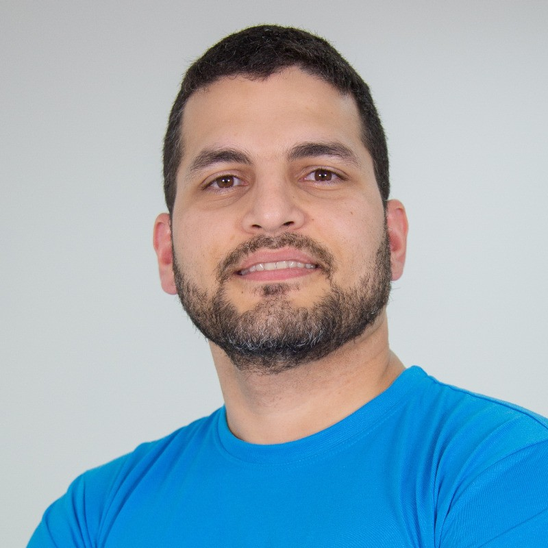
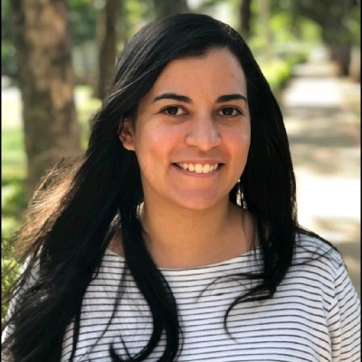

<a name="top">

## Supervision

1. [Graduate Apprenticeship (MSc)](#msc)
2. [Undergraduate (Final year)](#bachelor)

_Disclaimer #1: I was either the 1st or the only supervisor for all dissertations listed here._

_Disclaimer #2: All but one of the undergraduate dissertations listed here were published as international conference papers._

[Back to main page](index.md)

<a name="msc">
### Graduate Apprenticeship (MSc)

   

      
   

   

      <strong>Artificial intelligence governance at the 5th Region Federal Court: diagnostic and improvements</strong>  
      <em>MSc in Information technology </em> @ <a href="https://trf5.jus.br">5th Region Federal Regional Court (TRF5)</a> & <a href="https://ufrn.br">Federal University of Rio Grande do Norte (UFRN)</a>   
       

<!--  -->
   

   

      
   

   

      <strong>Municipal revenue at the Rio Grande do Norte state</strong>  
      <em>MSc in Information technology </em> @ <a href="https://www.tce.rn.gov.br">Court of Accounts of Rio Grande do Norte (TCE-RN)</a> & <a href="https://ufrn.br">Federal University of Rio Grande do Norte (UFRN)</a>   
       
 

<!--  -->
   

   

      
   

   

      <strong>A data-driven approach to aid payment auditing in the Court of Accounts of Rio Grande do Norte</strong>  
      <em>MSc in Information technology </em> @ <a href="https://www.tce.rn.gov.br">Court of Accounts of Rio Grande do Norte (TCE-RN)</a> & <a href="https://ufrn.br">Federal University of Rio Grande do Norte (UFRN)</a>   
       
 

<!--  -->
   

   

      
   

   

      <strong>Business intelligence to aid electoral accounts auditing in Rio Grande do Norte</strong>  
      <em>MSc in Information technology </em> @ <a href="https://www.tre-rn.jus.br">Regional Electoral Court of Rio Grande do Norte (TRE-RN)</a> & <a href="https://ufrn.br">Federal University of Rio Grande do Norte (UFRN)</a>   
       
 

<!--  -->
   

   

      
   

   

      <strong>A review of workflow management tools for ETL orchestration at TRE-RN</strong>  
      <em>MSc in Information technology </em> @ <a href="https://www.tre-rn.jus.br">Regional Electoral Court of Rio Grande do Norte (TRE-RN)</a> & <a href="https://ufrn.br">Federal University of Rio Grande do Norte (UFRN)</a>   
       
 

<!--  -->
   

---

<a name="bachelor">
### Undergraduate (Final year)

   

      
   

   

      <strong>Optimizing the operational logistics of an electrical energy distribution company</strong>  
      <em>BEng (Hons) in Computer engineering</em> @ <a href="https://ufrn.br">Federal University of Rio Grande do Norte (UFRN)</a>   
       
 

<!--   -->

   

   

      
   

   

      <strong>Comparing contextual embeddings for the semantic textual similarity in Portuguese</strong>  
      <em>BEng (Hons) in Computer engineering</em> @ <a href="https://ufrn.br">Federal University of Rio Grande do Norte (UFRN)</a>   
       
 

<!--   -->

   

   

      
   

   

      <strong>Assessing irace for automated machine learning</strong>  
      <em>BSc (Hons) in Computer science</em> @ <a href="https://ufrn.br">Federal University of Rio Grande do Norte (UFRN)</a>   
        
 

<!--   -->

   

   

      
   

   

      <strong>Using artificial intelligence to aid depression detection</strong>  
      <em>BEng (Hons) in Computer engineering</em> @ <a href="https://ufrn.br">Federal University of Rio Grande do Norte (UFRN)</a>   
       
 

<!--   -->

   

