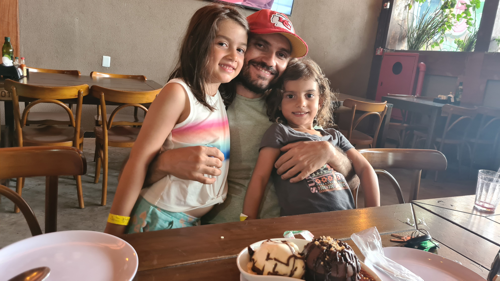

# Leonardo Bezerra
 
 

My thesis on **computational intelligence (CI)** was seminal to my
current research on **data science (DS)**, **artificial
intelligence (AI)**, and their impact on **socially relevant problems**.
Concerning DS, I supervise applied research projects with both the
public and private sectors. Partners include the Brazilian Judicial
Branch and Ministry of Education, as well as regional, national, and
multi-national companies in fields as diverse as retail,
telecommunications, and energy. Regarding AI, I supervise graduate
students on theses involving deep and automated machine learning, as
well as the intersection of multi-objective optimization with other CI
domains, such as multi-dimensional visualization and dynamic
optimization. Finally, regarding socially revelant problems, I have
assisted in the fight against the COVID-19 pandemic through science
publication and communication, in attempt to counter the intensive
disinformation campaign held in Brazil.

## History

### Appointments
| Start | End | Appointment | Institution | Location |
|---|---|---|---|---|
| 2017 | - | Assistant professor | [Federal University of Rio Grande do Norte (UFRN)](https://ufrn.br) | [Natal, RN, Brazil](https://goo.gl/maps/iS9PUqgSrShn9mEq8) | 
| 2016 | 2017 | Assistant professor | [Federal University of Paraíba (UFPB)](https://ufpb.br) | [João Pessoa, PB, Brazil](https://goo.gl/maps/LHXb9Srhdmmd6Krw7) | 

### Awards
| Start | End | Award | Institution | Location
|---|---|---|---|---|
| 2011 | 2016 | Ph.D. degree in Engineering and Technology | [Université Libre de Bruxelles (ULB)](https://ulb.ac.be/) | [Brussels, Belgium](https://goo.gl/maps/MKYig57yGJhiMnoi6) |
| 2011 | - | F.R.I.A doctoral fellowship | [Fonds de la Recherche Scientifique (FNRS)](https://frs-fnrs.be) | [Brussels, Belgium](https://goo.gl/maps/MKYig57yGJhiMnoi6) |
| 2009 | - | Best paper award | [Brazilian Symposium on Augmented and Virtual Reality (SVR)](https://grv.inf.pucrs.br/svr2009) | [Porto Alegre, RS, Brazil](https://goo.gl/maps/rKBGkSTUYFbKd5s29) |

### Languages

 
 
 
 
 

---

## Projects and funding

| Start | End | Project | Funder | Location | Role | Status
|---|---|---|---|---|---|---|
| 2023 | 2024 | [Information technology graduate internship (class of 2024)](https://residenciaregional.jfrn.jus.br) | [5th Region Federal Regional Court (TRF5)](https://trf5.jus.br) | [Recife, PE, Brazil](https://goo.gl/maps/FnsBrCsXqXjEDtaR9) | Collaborator | </a> |
| 2022 | 2023 | Technological innovation cell | [Iberdrola Neoenergia COSERN](https://trf5.jus.br) | [Natal, RN, Brazil](https://goo.gl/maps/iS9PUqgSrShn9mEq8) | Collaborator | </a> |
| 2021 | 2023 | [Information technology graduate internship (class of 2023)](https://residenciaregional.jfrn.jus.br) | [5th Region Federal Regional Court (TRF5)](https://trf5.jus.br) | [Recife, PE, Brazil](https://goo.gl/maps/FnsBrCsXqXjEDtaR9) | Proponent | </a> |
| 2020 | 2021 | Applied research and human resource education in hardware technologies for artificial intelligence | [Huawei Telecommunications in Brazil](https://huawei.com.br/) | [São Paulo, SP, Brazil](https://goo.gl/maps/LVmYC6tLVA67wJMh9) | Proponent | </a> |
| 2017 | 2018 | [SmartMetropolis](https://smlab.imd.ufrn.br/) | Multiple local and national government branches | [Natal, RN, Brazil](https://goo.gl/maps/iS9PUqgSrShn9mEq8) | Collaborator | </a> |
| 2017 | 2018 | [Revision and update of the Brazilian Standard Classification of Education (CINE Brasil 2018)](https://www.gov.br/inep/pt-br/areas-de-atuacao/pesquisas-estatisticas-e-indicadores/cine-brasil)) | [UNESCO](https://unesco.org/) & Brazilian Ministry of Education – [INEP](https://www.gov.br/inep/pt-br) | [Brasília, DF, Brazil](https://goo.gl/maps/CbpPfxbkoDqF7YD57) | Proponent | </a> |
| 2015 | 2016 | [Combinatorial optimization: metaheuristics and exact methods (COMEX)](https://www.belspo.be/belspo/fedra/proj.asp?l=en&COD=P7%2F36) | [Belgian Federal Science Policy Office (BELSPO)](https://belspo.be/) | [Brussels, Belgium](https://goo.gl/maps/MKYig57yGJhiMnoi6) | Collaborator | </a> |
| 2011 | 2015 | Generalization of metaheuristics for optimization problems with three or more objectives | [Fonds de la Recherche Scientifique (FNRS)](https://frs-fnrs.be) | [Brussels, Belgium](https://goo.gl/maps/MKYig57yGJhiMnoi6) | Proponent | </a>

---

## Key and relevant publications

### Journals (5)

**A computational study on ant colony optimization for the traveling salesman problem with dynamic demands**

 </a>  </a>  </a> 

This paper was the main contribution from the first Ph.D. thesis I
co-supervised, and demonstrates how multi-objective and dynamic
optimization intersect. The relevance of this paper is evidenced by its
best paper award nomination at the EMO 2019 conference, where a
preliminary version of the journal paper was first published. In
addition, this paper is a concrete example of how I bridge different
research topics into multi-disciplinary work.

---

**Comparing community mobility reduction between first and second COVID-19 waves**

 </a>  </a>  </a> 

This paper was the main contribution of my efforts in science
publication and communication to assist in the fight against the
COVID-19 pandemic. Indeed, the first author of this paper is one of the
undergraduate students that I helped mobilize in those initiatives. The
relevance of this paper is evidenced by the number of different
continents and COVID-19 waves included in the assessment. In addition,
this paper is a concrete example of how I use computational intelligence
in the context of socially relevant problems.

---

**Automatically designing state-of-the-art multi-and many-objective evolutionary algorithms**

 </a>  </a>  </a> 

**A large-scale experimental evaluation of high-performing multi-and many-objective evolutionary
algorithms**

 </a>  </a> </a> 

**Automatic component-wise design of multiobjective evolutionary algorithms**

 </a>  </a> </a> 

These papers comprise the contributions of my Ph.D. thesis, having been
accepted for publication prior to my defense or shortly after. Their
relevance is evidenced by their ongoing impact on the evolutionary
computation community, one of the most important in the context of CI,
and by the rigorous journals where they were published. More
importantly, these papers demonstrate how I am able to plan and deliver
on a research project. In detail, each paper meets an specific objective
of my thesis proposal, incrementally achieving the general objective of
the project.

---

### Conference papers (11)

**High school timetabling at a federal educational institute in Brazil**

 </a>  </a>  </a> 

**Retail sales forecasting for a Brazilian supermarket chain: an empirical assessment**

 </a>  </a>  </a> 

**Supermarket customer segmentation: a case study in a large Brazilian retail chain**

 </a>  </a>  </a> 

**Time-series features for predictive policing**

 </a>  </a>  </a>  

**Towards a crime hotspot detection framework for patrol planning**

 </a>  </a> 

These papers comprise the contributions of data science M.Sc. theses I
(co-)supervised in partnership with public and private institutions. The
relevance of these papers is evidenced by the socially relevant
scenarios they address. In detail, the first paper focuses on the
Brazilian Federal Network of Vocational, Scientific and Technological
Education, which provides education to over two million students, with
over half of the students that declared income, gender, and ethnicity
coming from low income families, being women, and self-declaring as
non-white. The remainder 2022 papers use AI techniques to model
different business processes in the 3rd largest retail supermarket chain
in the Northeast of Brazil, and is instrumental to assess the impact of
the COVID-19 pandemic in the industry. Finally, the 2018 papers address
predictive policing to assist the local government in the forecasting of
criminal occurrences.

---

**Evaluating anytime performance on NAS-Bench-101**

 </a>  </a>  </a> 

**iSklearn: automated machine learning with irace**

 </a>  </a>  </a> 

**Comparing contextual embeddings for semantic textual similarity in Portuguese**

 </a>  </a>  </a> 

These papers are the contributions of M.Sc. theses I supervised in deep
and automated machine learning. The relevance of these papers is
evidenced by the state-of-the-art techniques that were employed. In
addition, the application domains considered are among the most relevant
that use unstructured data, namely computer vision, natural language
processing, and time series forecasting. Importantly, these papers
demonstrate that I understand the technological complexity of current
state-of-the-art AI models, their potential impact on society, and
therefore their need for accountability.

---

**Revisiting Pareto-optimal multi-and many-objective reference fronts for continuous optimization**

 </a>  </a>  </a> 

Archiver effects on the performance of state-of-the-art multi-and many-objective evolutionary algorithms

 </a>  </a>  </a> 

**An empirical assessment of the properties of inverted generational distance on multi-and many-objective optimization**

 </a>  </a>  </a> 

These papers comprise follow-up works on my Ph.D. thesis. The relevance
of these papers is evidenced by their ongoing impact on the evolutionary
computation community, as well as the conferences where they were
published, which are among the top-tier venues in their field. More
importantly, these papers are a concrete example that the work I
conducted in my Ph.D. was seminal to relevant future work. In addition,
they demonstrate that I understand that seeking autonomy as an
independent researcher does not mean discontinuing previous research.

## Supervision
